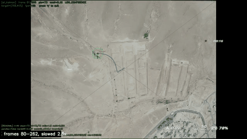

# Selected-Object Video Tracker

**Intro to Image Processing · course project**
Katya Pavlov · Guy Rabinovich

Click one pixel on the first frame of a video. The tracker follows what is there,
notices on its own when it has lost it, and finds it again when it comes back.
Classical computer vision only (OpenCV + NumPy), real time on a laptop CPU, no GPU,
no training.

<p align="center">
  
</p>

*One run on aerial footage: the target leaves the frame, the box turns red (LOST),
the search runs, and a few seconds later the target is re-acquired and the box
returns to yellow. The full-resolution aerial clip we developed on is not ours to
publish, so this repository ships a clip we recorded ourselves instead
(`videos/room_demo.mp4`) and a screen recording of the tracker running on it
(`demos/room_demo_run.mp4`).*

---

## Quick start

```bash
python3 -m pip install -r requirements.txt
python3 -m ground_target_tracking.main --video videos/room_demo.mp4
```

A window opens on the first frame. Click the pixel you want to track and press
**Enter**. While running: yellow box = tracking, orange = low confidence, red = lost
(search active). Press **q** to quit.

Other ways to run:

```bash
# pick the pixel by coordinates instead of clicking (x,y or row,col); 1040,620 is on the shirt in frame 0
python3 -m ground_target_tracking.main --video videos/room_demo.mp4 --point 1040,620
python3 -m ground_target_tracking.main --video videos/room_demo.mp4 --point-rc 620,1040

# headless: no window, write the annotated video + per-frame log to logs/
python3 -m ground_target_tracking.main --video videos/room_demo.mp4 --point 1040,620 --no-display --save

# tracking only, no re-acquisition
python3 -m ground_target_tracking.main --video videos/room_demo.mp4 --no-reacq
```

Tested with Python 3.9+, `opencv-python >= 4.4` (SIFT is included in mainline
OpenCV), NumPy.

---

## How it works

The talk and the code follow the same four parts. Every number below lives in
`ground_target_tracking/config.py`.

### 1 · Preprocessing
- **HUD mask.** The aerial footage carries burned-in graphics (a large X and a
  crosshair). They never move, so any motion estimator would lock onto them. The
  mask is built once, geometrically, and tells every later stage *where not to
  measure*. Selecting a target under the graphics is still allowed; the evidence
  is gathered from the clean surroundings.
- **ROI.** A 51×51 px box around the selected pixel, kept inside the frame. It is
  the initial description of the target.
- **Grayscale.** Tracking works on brightness only. CLAHE is applied only on the
  feature-matching path, never before optical flow.

### 2 · Tracking the pixel
- **Corners (Shi–Tomasi).** The pixel itself is usually not trackable, so we
  track its neighbourhood: up to 120 corners inside a box that grows from a
  40 px radius to 120 px until at least 10 clean corners are found.
- **Lucas–Kanade optical flow.** 21×21 window, 3 pyramid levels. Each corner is
  tracked forward to the next frame and back again; a corner that does not
  return to within 1 px of its start is discarded (forward–backward check).
- **RANSAC on a similarity transform.** The surviving corners vote for one
  motion (shift + rotation + scale). Outliers never vote. The selected pixel is
  carried through the winning transform.

### 3 · Prediction when the pixel is lost
- **Kalman filter.** Constant-velocity model over (x, y, vx, vy). Predict every
  frame, correct when RANSAC delivers a measurement, coast on the prediction
  for up to 15 frames when it does not.
- **Confidence.** `C = motion quality × appearance (NCC vs the reference) × edge
  factor`; a one-frame jump larger than 102 px sets `C = 0`.
- **State machine.** `C ≥ 0.40` TRACKING · `C < 0.40` LOW_CONFIDENCE ·
  `C < 0.15` for 20 consecutive frames → LOST. Hysteresis: one bad frame is never
  a loss, and returning to TRACKING needs `C ≥ 0.45`. A separate check detects a
  frozen input feed (FEED_FROZEN) so a stuck video is not mistaken for a lost
  target.

### 4 · Re-acquisition
- **SIFT** keypoints and 128-value descriptors are computed on a reference
  snapshot taken while tracking was still confident (keypoints within 150 px of
  the pixel, HUD excluded) and on the current frame. Matches pass Lowe's ratio
  test (0.8) and a RANSAC similarity fit, which also transports the pixel.
- **Real time.** A whole-frame SIFT pass is far above the per-frame budget, so
  the frame is split into 8 horizontal stripes and one stripe is searched per
  frame while the video keeps playing.
- **Verification.** Three consecutive consistent detections (≤ 30 px apart,
  scale within ±25 %) are required, then a probation period: tracking restarts
  in LOW_CONFIDENCE and needs 5 healthy frames within 15 to return to TRACKING.
  A bad frame or a timeout sends it back to LOST.

Design rule throughout: **prefer LOST over a false lock.**

More detail: [ARCHITECTURE.md](ARCHITECTURE.md), the
[state machine](docs/tracking_state_machine.md) and the
[block diagram](docs/system_block_diagram.md).

---

## Repository structure

```
├── ground_target_tracking/   the tracker
│   ├── main.py               CLI, UI, video loop
│   ├── session.py            confidence, state machine, recovery control
│   ├── trackers.py           corners, Lucas–Kanade, RANSAC, Kalman
│   ├── reacquisition.py      SIFT / ORB / template search, probation
│   ├── preprocessing.py      grayscale, CLAHE, HUD-aware pipelines
│   ├── utils.py              ROI, HUD mask, drawing
│   └── config.py             every tunable number
├── tests/                    unit tests + synthetic scenes
├── docs/                     state machine, block diagram
├── videos/room_demo.mp4      sample input we recorded (1080p, 16 s)
└── demos/                    room_demo_run.mp4 (screen recording), drone_run_exit_lost_return.gif
```

## Tests

```bash
python3 -m unittest discover tests
```

The suite runs on synthetic scenes; no video files are needed.

---

## Limitations

- **Low texture.** No corners means no optical flow and no SIFT; the tracker
  reports LOST honestly instead of guessing.
- **Fixed 51×51 ROI.** The point is tracked, the box is not; NCC checks three
  scales only, so a large zoom weakens the appearance check.
- **Near-identical decoys.** Appearance alone cannot tell two copies of the
  same texture apart.
- **Static live scene.** A camera that does not move at all looks like a frozen
  feed to the frame-difference detector.

Ideas we tried and removed: whole-frame SIFT (too slow, replaced by stripes) and
letting the Kalman prediction re-anchor the optical-flow tracker while coasting
(it manufactured false locks under zoom).
